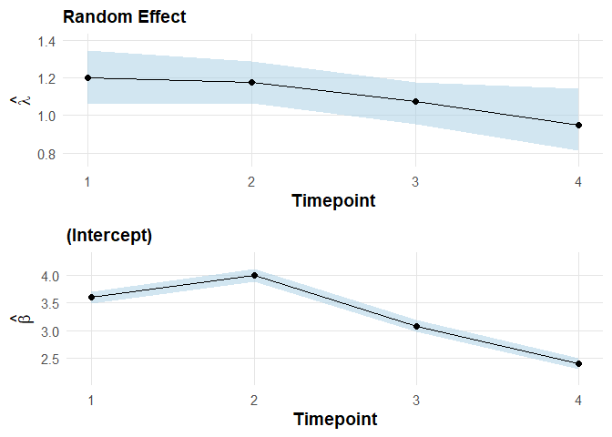
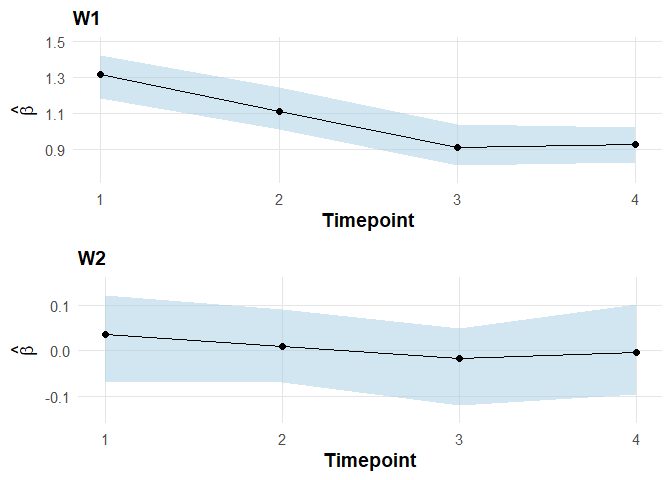

<!-- README.md is generated from README.Rmd. Please edit that file -->

# panelTVP

Hi folks and welcome to the package panelTVP!

This package provides functions for fitting Bayesian regression models
for panel data with time-varying parameters. The functions in this
package were created by Roman Pfeiler and Helga Wagner. Maintainer of
the package is Roman Pfeiler (<roman.pfeiler@jku.at>).

## Installation

You can install the development version of panelTVP from Roman Pfeiler’s
personal GitHub page [GitHub](https://github.com/pfeilR/)

``` r
install_github("pfeilR/panelTVP")
```

## Introduction to the package

The main goal of this package is to fit flexible Bayesian regression
models for panel data in the time-varying parameter framework. The model
is flexible in the sense that for each covariate and the
subject-specific random effect, time-varying effects are estimated. For
the random effects, a factor model specification is used, where
time-varying factor loadings are multiplied with subject-specific factor
scores. This strategy allows estimation of time-varying random effects.
To avoid overfitting, hierarchical shrinkage priors are used to identify
whether an effect is time-varying, time-invariant or zero. The following
models are implemented:

- Gaussian model for normally distributed responses
- Logit / Probit model for binary responses
- Negative Binomial model for overdispersed count data
- Zero-Inflated Negative Binomial model for zero-inflated and
  overdispersed count data

## Small case-study: Gaussian response data

In the following, we show how to fit a Bayesian time-varying parameter
model for panel data, where the conditional distribution of the response
variable is assumed to be Gaussian. For simplicity, the statistical
analysis is based on simulated data.

Data can be simulated by using the function sim_panelTVP() from the
panelTVP package as follows:

``` r
devtools::load_all()
#> ℹ Loading panelTVP
#> Warning: Paket 'LaplacesDemon' wurde unter R Version 4.4.3 erstellt
d <- sim_panelTVP(n = 1000,
                  Tmax = 4,
                  model = "Gaussian",
                  beta = c(4,1,0),
                  theta = c(1,0.5,0),
                  lambda = 1,
                  psi = 0.2,
                  sigma2 = 3)
```

Object **d** contains the generated dataset that includes the covariates
and columns with time and subject indices, respectively:

``` r
head(d$observed, 10)
#>            y          W1         W2 t id
#> 1   7.617181 -3.03483653  0.5509968 1  1
#> 2   4.244999 -1.14245831  0.4680761 1  2
#> 3   9.564388  1.90525965 -0.4909016 1  3
#> 4   9.859049  0.05445150  0.8117996 1  4
#> 5   5.605467 -0.03563700  0.7364333 1  5
#> 6  12.595993  0.79210568 -1.4173714 1  6
#> 7   6.862774 -0.01480892  1.5901582 1  7
#> 8   8.176793  0.08959494 -0.7554648 1  8
#> 9   7.939357 -1.53350196  0.2257706 1  9
#> 10  5.905344  0.21072660  0.5654140 1 10
```

The time varying regression effects and factor loadings can be accessed
as follows:

``` r
d$beta
#>          [,1]      [,2] [,3]
#> [1,] 6.825530 0.5462133    0
#> [2,] 6.830465 0.1258015    0
#> [3,] 6.886584 0.1115765    0
#> [4,] 7.170491 0.3876807    0
d$lambda
#>          [,1]
#> [1,] 1.251396
#> [2,] 1.189696
#> [3,] 1.075011
#> [4,] 0.851897
```

It should be noted that the first covariate effect corresponds to the
global intercept.

For fitting a Bayesian time-varying parameter model to the panel data,
the main function panelTVP() is used. The function contains a lot of
arguments, which are explained in greater depth in the corresponding
help page. Moreover, only a very small number of draws in MCMC
estimation are used here as this is only an illustrative example. In
applications, you should opt for a longer Markov Chain.

``` r
res <- panelTVP(y ~ W1 + W2,
                data = d$observed,
                model = "Gaussian",
                mcmc.opt = list(chain.length = 500, burnin = 100, thin = 2, asis = TRUE))
#> [1] "Algorithm took 4.55 seconds"
```

A summary table of the estimated coefficients can easily be created by
calling the corresponding S3-function:

``` r
summary(res)
#> 
#> ------------------------------------------------------------------------------
#> Posterior Summary of the Bayesian Normal Model with Time-Varying Coefficients:
#> ------------------------------------------------------------------------------
#> ==================================================
#>             Estimates for (Intercept)
#> ==================================================
#> 
#>     Lower (HPD) Posterior Mean Upper (HPD)     SD
#> t=1      6.6806         6.7971      6.8928 0.0552
#> t=2      6.6714         6.7607      6.8675 0.0528
#> t=3      6.8337         6.9079      7.0088 0.0464
#> t=4      6.9900         7.0997      7.2144 0.0580
#> 
#> ==================================================
#>                  Estimates for W1
#> ==================================================
#> 
#>     Lower (HPD) Posterior Mean Upper (HPD)     SD
#> t=1      0.4337         0.5506      0.6728 0.0615
#> t=2      0.0204         0.1319      0.2464 0.0622
#> t=3      0.0346         0.1466      0.2576 0.0578
#> t=4      0.3365         0.4430      0.5490 0.0555
#> 
#> ==================================================
#>                  Estimates for W2
#> ==================================================
#> 
#>     Lower (HPD) Posterior Mean Upper (HPD)     SD
#> t=1     -0.0403         0.0053      0.0492 0.0232
#> t=2     -0.0622        -0.0018      0.0558 0.0293
#> t=3     -0.0283         0.0076      0.0639 0.0233
#> t=4     -0.0389         0.0125      0.0917 0.0312
#> 
#> ==================================================
#>                  Estimates for λ
#> ==================================================
#> 
#>     Lower (HPD) Posterior Mean Upper (HPD)     SD
#> t=1      1.0900         1.2139      1.3480 0.0652
#> t=2      1.0745         1.2023      1.3183 0.0645
#> t=3      0.9772         1.1261      1.2545 0.0686
#> t=4      0.7680         0.8989      1.0478 0.0752
```

Alternatively, results can also be ordered by time point:

``` r
summary(res, by = "timepoint")
#> 
#> ------------------------------------------------------------------------------
#> Posterior Summary of the Bayesian Normal Model with Time-Varying Coefficients:
#> ------------------------------------------------------------------------------
#> ==================================================
#>             Estimates for Timepoint 1
#> ==================================================
#> 
#>             Lower (HPD) Posterior Mean Upper (HPD)     SD
#> (Intercept)      6.6806         6.7971      6.8928 0.0552
#> W1               0.4337         0.5506      0.6728 0.0615
#> W2              -0.0403         0.0053      0.0492 0.0232
#> λ                1.0900         1.2139      1.3480 0.0652
#> 
#> ==================================================
#>             Estimates for Timepoint 2
#> ==================================================
#> 
#>             Lower (HPD) Posterior Mean Upper (HPD)     SD
#> (Intercept)      6.6714         6.7607      6.8675 0.0528
#> W1               0.0204         0.1319      0.2464 0.0622
#> W2              -0.0622        -0.0018      0.0558 0.0293
#> λ                1.0745         1.2023      1.3183 0.0645
#> 
#> ==================================================
#>             Estimates for Timepoint 3
#> ==================================================
#> 
#>             Lower (HPD) Posterior Mean Upper (HPD)     SD
#> (Intercept)      6.8337         6.9079      7.0088 0.0464
#> W1               0.0346         0.1466      0.2576 0.0578
#> W2              -0.0283         0.0076      0.0639 0.0233
#> λ                0.9772         1.1261      1.2545 0.0686
#> 
#> ==================================================
#>             Estimates for Timepoint 4
#> ==================================================
#> 
#>             Lower (HPD) Posterior Mean Upper (HPD)     SD
#> (Intercept)      6.9900         7.0997      7.2144 0.0580
#> W1               0.3365         0.4430      0.5490 0.0555
#> W2              -0.0389         0.0125      0.0917 0.0312
#> λ                0.7680         0.8989      1.0478 0.0752
```

Covariate effect plots - that include the estimated factor loadings as
well - are created as follows:

``` r
plot(res, nplots = 2)
```



    #> The plots are out there, hit [Return] to see ...



As we can see, the insignificant effect of covariate **W2** is
effectively shrunken towards zero, while the other effects vary over
time - as we would expect based on how the data were generated.

## The end?

Note that this was just a very simple and quick example for the sake of
a creating a first overview of the package. For a more thorough
introduction to the package visit the packages’ Vignette under **INSERT
LINK TO VIGNETTE**.
